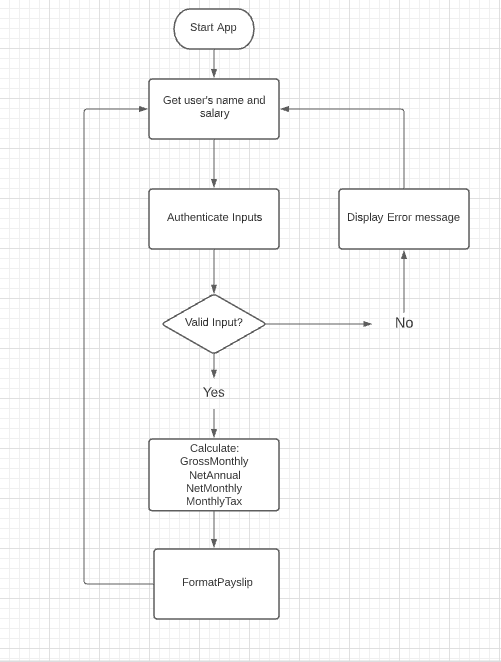
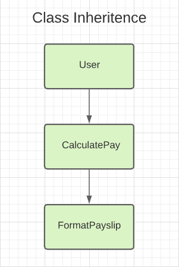

# Employee monthly payslip

## Installation, Setup, and Tests

---

**1.** **System Requirements**

Ensure you have Node and Yarn installed on your computer.

You can check if you have either installed by running in terminal:
`node -v`

To install follow the steps below:

1. Install Node here: https://nodejs.org/en/download/package-manager/

**2. Download Tax calculator**
`git clone github.com`

Alternatively, navigate to github.com and download the zip file.
Then extract all documents.

**3. Download dependencies**
Open the root folder in terminal and run `npm install`

**4. Run Tax Calculator**
Open the root folder in terminal and run `node app.js`

**5. To Run tests**
Open the test folder in terminal
Run `yarn test <filename>.test.js`

<br>

(Only `CaculatePay.test.js` is working at the moment. Please contact Ananda for information)

## Software Development Plan

---

### Requirements

---

1. Must be a terminal application
2. Must be able to input: Name
3. Must be able to input: Annual salary
4. App returns: Name
5. App returns: Gross monthly Income
6. App returns: Monthly income tax
7. App returns: Net monthly income

### Purpose

---

This application's purpose is to show the user their gross monthly income, monthly income tax, and net monthly income

### Tech Stack

---

- JavaScript to write the application
- Node to execute the JavaScript within our terminal
- Yarn to run the tests on our application

As we only want to input a user's name and salary, then to read their monthly data, there was no need to implement full CRUD operations.

<br>

### Assumptions

---

- We are finding the average monthly salary (Following provided formula)
- Therefore all months are of equal length

### Tradeoffs

---

- We cannot find an exact months pay (Only average)
- Some months may skew average monthly data
- We cannot view a particular days pay

## Design

---

### Control Flow Diagram

---



<br>

### Classes

---

<br>



### User

User is the most parent class.
User gets and sets our information about the person (Name, Salary)

### CalculatePay

CalculatePay extends the User class.
Calculate pay contains all the calculations that is needed to return our desired output

### FormatPayslip

FormatPayslip extends the CaculatePay class
FormatPayslip returns our desired output in a cleanly formatted response


<br>

## Why this design?

---

I used classes to enable me to organize my code into objects that focus on one part of the problem. Doing so allows us to create a more maintainable and scalable codebase.

If we wanted to add extra features in the future, using classes allows us to make use of polymorphism. (Extending parent classes with its own unique characteristics)
As an example, we could make multiple different formated payslip classes.

<br>

### Calculating Logic

---

```JavaScript
this.taxRate = [
      0, // 0-20
      0.1, // 20-40
      0.2, // 40-80
      0.3, // 80-180
      0.4, // 180+
    ];

    this.maxTaxs = [
      0, //   0  - 20000
      0, //   20000 - 40000
      2000, // > 40000
      10000, // > 80000
      40000, // > 180000
    ];

    this.taxBrackets = [
      0, // 0  - 20
      20000, // 20 - 40
      40000, // 40 - 80
      80000, // 80 - 180
      180000, // 180+
    ];
  }

  calcAnnualTax() {
    let salary = this.salary;
    let taxBrackets = this.taxBrackets;
    let tax = 0;

    for (let i in taxBrackets) {
      if (salary > taxBrackets[i]) {
        tax = this.maxTaxs[i];
        tax += (salary - taxBrackets[i]) * this.taxRate[i];
      }
    }
    this.annualTax = tax.toFixed(2);
  }

```

---

The logic above allows us to calculate our annual tax dynamically.
The arrays: taxRate, maxTaxs and taxBrackets arrays may take up a few more lines of code than other possible solutions. However, if we need to make changes to a tax rate or tax bracket. We only have to change the code in the array, we wouldn't have to make changes in our calculations logic or any methods.

As we can calculate all required outputs from AnnualTax, our other calculations are dynamic.

---

```JavaScript

  calcNetAnnunal() {
    this.calcAnnualTax();
    let netAnnual = this.salary - this.annualTax;
    this.netAnnual = netAnnual.toFixed(2);
  }

  calcNetMontly() {
    let netMonthly = this.netAnnual / 12;
    this.netMonthly = netMonthly.toFixed(2);
  }

  calcGrossMonthly() {
    let grossMonthly = this.salary / 12;
    this.grossMonthly = grossMonthly.toFixed(2);
  }

  calcMonthlyTax() {
    let monthlyTax = this.annualTax / 12;
    this.monthlyTax = monthlyTax.toFixed(2);
  }
```

## Tradeoffs in my code design

---

**1. The application runs on a loop**
As our application runs in a loop, it will continually ask for new information about a user.

**2. Prompts user for name and salary**
We prompt the user for a name and salary rather than taking in terminal arguments.
I struggled with making test cases for these methods as terminal prompts in JS are not native.
